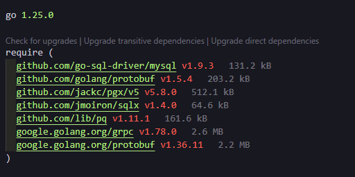

# Package Size Inline

A VS Code extension that shows **package/module sizes** (in kB/MB) inline next to dependencies in:

- `package.json` (`dependencies` and `devDependencies`)
- `go.mod`

For `package.json`, sizes are fetched from the **npm Registry** (`unpackedSize`). For `file:` dependencies, the size shown is the size of the package as installed in `node_modules` (built/minified output).

For `go.mod`, sizes are fetched from the **Go module proxy** archive size for each module version.

## Example


go.mod example



Inline annotations (e.g. **5.6 MB**, **81.6 kB**) appear next to each package version.

## Installation

### From Open VSX Registry
```bash
ovsx install El1k-1.package-size-inline
```

### From VS Code Marketplace
Search for "Package Size Inline" in VS Code Extensions marketplace.

### Manual Installation
1. Download the `.vsix` file from [Releases](https://github.com/YOUR_USERNAME/package-size-inline/releases)
2. In VS Code: **Extensions** → **...** → **Install from VSIX**

## How to use

1. Install the extension (or run from folder via **Run and Debug**).
2. Open `package.json` or `go.mod`.
3. Each dependency/module line will show a label like `12.5 kB` to the right (or `—` if the size could not be determined).

## Settings

- **packageSizeInline.enabled** — Turn inline size display on or off.

## Development

```bash
cd package-size-inline
npm install
npm run compile
```

In VS Code: **Run and Debug** → **Run Extension**. A new window opens with the extension loaded; open `package.json` or `go.mod` there.

## Packaging .vsix

```bash
npm install -g @vscode/vsce
vsce package
```

Then: **Extensions** → **...** → **Install from VSIX** and select the `.vsix` file.

## License

MIT — see [LICENSE](LICENSE).
